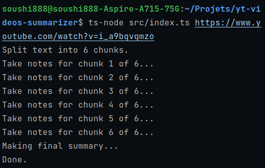

# YouTube Transcript Summarizer

This program uses OpenAI's GPT-3.5 Turbo model to automatically summarize YouTube video transcripts. It fetches the
transcript, generates detailed notes for each part of the transcript, and creates a final summary based on the notes.

## Prerequisites

- Node.js (version 12 or higher) and corresponding npm
- An OpenAI API key with access to GPT-3.5 Turbo

## Installation

1.Clone this repository:

```bash
git clone https://github.com/Soushi888/yt-videos-summarizer.git
```

2.Install npm packages:

```bash
npm install
```

3. Copy the `.env.example` file to a new file called `.env`:

```bash
cp .env.example .env
```

4. Update the `.env` file with your OpenAI API key and organization:

```bash
OPENAI_API_KEY=your_openai_api_key
OPENAI_ORGANIZATION=your_openai_organization
```

## Chunk Size

```bash
# Chunk size is the number of characters that will be sent to OpenAI at once.
# Reduce this if you are getting 400 errors. Increase it if you are getting 413 errors.
# Lowering this will increase the number of requests made to OpenAI, but make more prcise notes.
# The default is 4000.
CHUNK_SIZE=4000
```

## System Prompts

The program uses the following prompts to generate the detailed notes and the final summary:

```ts
enum SystemPrompt {
	NOTES = "Write detailed notes about this video transcript part in a bullet list .\n\n---\n\nTranscript part:\n\n",
	FINAL_SUMMARIZE = "Create a full detailed summary from those notes.\n\n---\n\nNotes:\n\n",
}
```

## Usage

To summarize a YouTube video transcript, run the following command with the video URL as an argument:

```bash
node index.js https://www.youtube.com/watch?v=video_id
```

The program will fetch the transcript, split it into chunks, generate detailed notes for each chunk, and create a final
summary. The detailed notes will be saved in a file called `notes.md`, and the summarized transcript will be saved in a
file called `summarized_transcript.txt`.

## Example



Input link: https://www.youtube.com/watch?v=i_a9bqvqmzo

For a video named "**How to Build a FULL App With ChatGPT in 20 minutes!**", length 18 minutes and 35 seconds, the
program generated the following files:

- [notes.md](examples/notes.md)
- [summarized_transcript.txt](examples/summarized_transcript.txt)

### Summarized Transcript

In the video, the speaker uses artificial intelligence (AI) technology to create a full-stack blockchain application in under 20 minutes. The speaker claims to have no prior coding knowledge and uses AI prompts to generate the necessary code.

The speaker uses Chat GPT and Stable Diffusion to prompt instructions for creating a full-stack blockchain app using Ethereum. The speaker installs text editors, node.js, Ganache, Truffle, and Metamask.

Using Chat GPT, the speaker is provided with a full smart contract code for an NFT collection. OpenZeppelin contracts are installed and imported, and the NFT smart contract file is added to the Truffle project. The smart contract is deployed using the migration script, which is run using the triple migrate command.

The front end is developed using React.js, and the app is connected to the smart contract using web3.js. The images for the NFTs are generated using AI image generators and added to the app.

The speaker emphasizes that the technology shown in the video will not replace coders completely, but it will help increase their effectiveness and help them accomplish tasks faster. The AI technology can be used to accelerate learning and development, but coding skills are still necessary.

The speaker encourages viewers to subscribe to their channel for more blockchain-related content and to join their bootcamp at adaptiveversion.com to become a "blockchain master." The bootcamp does not require any coding experience and aims to help individuals become in-demand blockchain developers, increase their salary, and break into the booming blockchain industry.